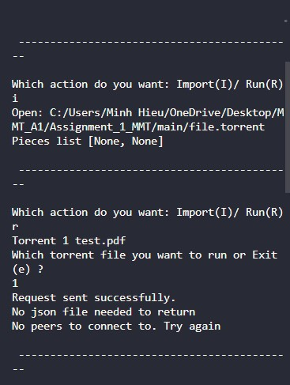
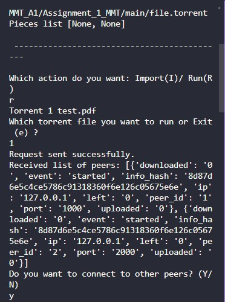
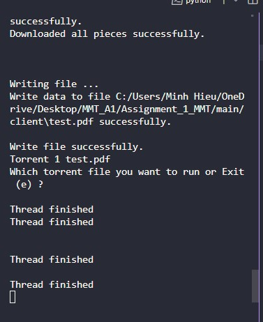

# Assignment_1_MMT

## Các file chính trong chương trình này:
- tracker.py: Đây là file chạy đại diện cho tracker server, có vai trò lắng nghe và gửi dữ liệu tới 
- peer1, peer2.py: Đại diện cho 2 peer trong hệ thống với 2 thư mục đại diện cho 2 máy peer (2 máy peer này chứa đầy đủ các files giống như trong torrent)
- client.py: Đại diện cho máy client, code giống y như peer1 và peer2 nhưng thư mục của client là thư mục trống (port là 9999 khác với các peer là 1000 và 2000)
- torrent.py: chứa các lệnh liên quan đến việc xử lý đối với file torrent
- peer_func.py: chứa các lệnh liên quan tới các peer (các lệnh gửi và nhận request)
- 3 thư mục lớn đại diện cho 3 máy (2 peer và 1 client): 2 peer chứa cả 2 file pdf nhưng client thì để trống
- 2 file torrent: file.torrent là torrent chỉ chứa một file duy nhất, folder.torrent là torrent chứa nhiều file (2 files)

## Hướng dẫn chạy mẫu
### Chạy 4 terminal
- Đầu tiên chạy tracker.py rồi để đó không làm gì với nó nữa. Tracker chỉ có việc lắng nghe và phản hồi các request thôi
- Tiếp theo chạy các file peer1.py, peer2.py và client.py. Khi chạy các file thì nó sẽ hiện ra cửa sổ yêu cầu mình chọn thư mục. Ta sẽ chọn thư mục trùng với tên file, ví dụ như peer1.py thì chọn thư mục peer1, peer2.py thì chọn thư mục peer2, client.py thì chọn thư mục client

### Import torrent file cho mỗi máy
- Để mô phỏng việc máy bình thường tải file torrent về máy thì ta sẽ import file torrent đó vào máy để chương trình tự động lưu thông tin nó về máy.
- Các file peer và client khi chạy thành công thì sẽ hiện câu hỏi 'Which action do you want: Import(I)/ Run(R)'. Ta nhập 'i' nếu máy đó chưa có file torrent nào. 
- Khi nhập 'i' thì sẽ hiện cửa sổ chọn tệp, lưu ý chỉ chọn tệp torrent. Nếu muốn test torrent 1 file thì chọn file.torrent, còn không thì chọn folder.torrent. Chọn file torrent cho cả 3 máy peer1, peer2 và client

### Chạy file torrent và gửi request
- Việc chạy file torrent thì phải chạy 2 máy peer trước sau đó mới chạy của client. Bởi vì nếu client gửi request tới tracker đầu tiên thì tracker sẽ không có máy để gửi về cho client
- Cũng câu hỏi khi nãy: 'Which action do you want: Import(I)/ Run(R)' nhưng bây giờ mình sẽ chọn 'r' để chạy
- Câu hỏi khác: 'Which torrent file you want to run or Exit (e) ?'. Mình xem các file torrent đã lưu vào máy trước đó như 'Torrent 1 test.pdf'. Bởi vì mình muốn tải test.pdf thì mình sẽ nhấn '1'. Dưới đây là ảnh mẫu

- Khi gửi thành công thì tracker sẽ response về cho từng máy. Đối với máy peer1 và peer2 thì tracker sẽ gửi No json file needed to return bởi vì các máy peer đã có sẵn file rồi. Nhưng với client thì sẽ được tracker gửi về một list các peer chứa file test pdf mà nó cần tải mà nó không có

### Client.py tiến hành gửi download request tới các peer
- Hệ thống sẽ hỏi 'Do you want to connect to other peers?' trong file client.py thì ấn 'y' như yes
- Ấn xong thì nó sẽ tự động download và sẽ có file trong thư mục client
